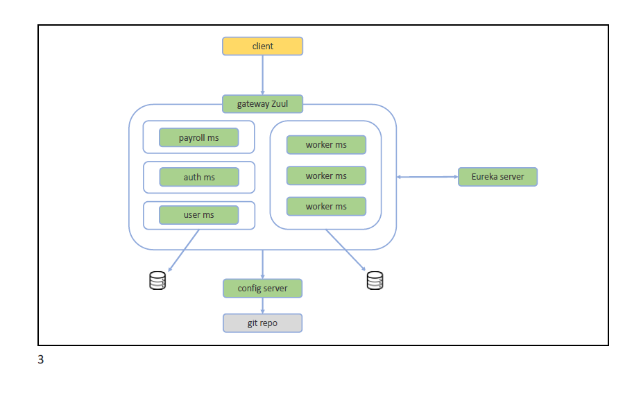
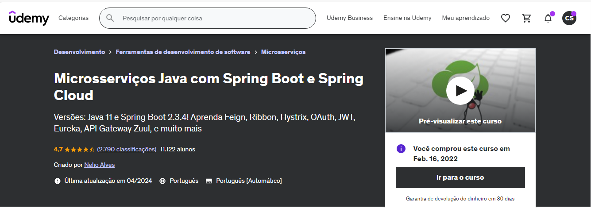

# Curso Microsserviços Java com Spring Boot e Spring Cloud


## Atenção: curso específico para versões Java 11 e Spring Boot 2.3.4
#### Nelio Alves 
- https://www.udemy.com/user/nelio-alves


# Tecnologias e Dependências do Projeto

- JDK 11
- Spring Boot 2.3.4
- Spring Data JPA
- Spring Cloud Eureka Server e Client
- Spring Cloud Config Server
- Spring Cloud Zuul
- Spring Cloud Oauth2
- Spring Cloud OpenFeign
- Spring Cloud Ribbon
- Configurar credenciais do config server
  - Modelo do curso: https://github.com/acenelio/ms-course-configs
- Preparar Postman (collection e environment)
- Subir projetos em ordem:
  - Config server
  - Eureka server
  - Outros Projetos

## Estrutura:



## Visão do projeto:

* Montar a estrutura do projeto, a comunicação entre os microsserviços, a configuração automatica, escala automatica e balanceamento de carga. 

* desenvolver um sistema com alguns microserviços.

* Serviço de trabalhadores, que estará conectado com um banco de dados, onde iremos manter um cadastro de cada trabalhador.

* Microsserviço de folha de pagamento

* Microsserviços de usuarios, que estará anexado a um banco de dados, com permissao e perfil de acesso para cada usuario.

* Serviço de autorização e autenticação, com protocolo OAuth e tokens JWT, padrão usado por industrias bem populares.

* Os microserviços irão se registrar em um servidor Discovery Eureka.

* API gateway para rotear os microsserviços

* Servidor de configuração.

## Implementação utilizando as ferramentas do ecossistema Spring com Java

* Banco de dados H2: banco de dados em memoria, para testes

* Ferramenta Postman: Para testar as requisições e criar um ambiente de produção

* JPA : biblioteca padrão de persistência de dados no java, baseado no mapeamento objeto relacional

* Service Discovery (Eureka): O Service Discovery, especificamente referenciando o Eureka (um serviço de descoberta de serviços desenvolvido pela Netflix), é uma peça fundamental em arquiteturas de microserviços. Em resumo, o Eureka (e outros serviços de descoberta de serviços) serve para facilitar a comunicação e a coordenação entre os microserviços em uma arquitetura distribuída, permitindo que os serviços se registrem dinamicamente, sejam descobertos pelos clientes de forma transparente, e contribuam para o balanceamento de carga e a manutenção da integridade do sistema.

* Config Server ( spring-cloud-config-sever ) : O spring-cloud-config-server é um componente da família Spring Cloud que fornece um servidor de configuração centralizado para aplicativos baseados em Spring Boot. Ao anotar uma classe de configuração com @EnableConfigServer, você está habilitando esse aplicativo Spring Boot para funcionar como um servidor de configuração. A função principal do spring-cloud-config-server é fornecer um local centralizado para armazenar as configurações de vários serviços ou aplicativos em um ambiente distribuído. Em vez de manter as configurações em cada aplicativo, elas são armazenadas em um repositório de configuração (como Git, SVN, etc.) e acessadas dinamicamente pelos aplicativos conforme necessário. Em resumo, o spring-cloud-config-server é uma ferramenta fundamental para gerenciar e distribuir configurações de forma centralizada em uma arquitetura baseada em microserviços, facilitando a manutenção, a atualização e a segurança das configurações em um ambiente distribuído.

* API Gateway Zuul :  O API Gateway Zuul é uma ferramenta utilizada no desenvolvimento de microserviços e arquiteturas baseadas em nuvem. Ele atua como um gateway de entrada para os serviços de uma aplicação, fornecendo uma camada de abstração entre os clientes e os microserviços que compõem a aplicação. Em resumo, o Zuul facilita o gerenciamento do tráfego de entrada em uma arquitetura de microserviços, oferecendo recursos como roteamento dinâmico, segurança, monitoramento e escalabilidade são as principais funções do Zuul.

* Open Feign Client : O OpenFeign é uma biblioteca de cliente HTTP para Java que simplifica a comunicação entre serviços em uma arquitetura de microserviços. Ele é especialmente útil em aplicações que seguem princípios de arquitetura baseada em nuvem, onde os serviços precisam se comunicar uns com os outros de forma eficiente e transparente. Em resumo, o OpenFeign é uma ferramenta poderosa para simplificar a comunicação entre serviços em uma arquitetura de microserviços, oferecendo uma abordagem declarativa e fácil de usar, integração com o Spring Cloud, balanceamento de carga, tolerância a falhas e suporte a testes.

* Security Oauth : OAuth (Open Authorization) é um protocolo de autorização amplamente utilizado na web para permitir que os usuários concedam acesso a recursos sem compartilhar suas credenciais, como nome de usuário e senha. Ele é projetado para fornecer uma maneira segura e padronizada para autorizar aplicativos de terceiros a acessar recursos em nome do usuário, sem revelar suas credenciais.
O OAuth é comumente usado em cenários onde um aplicativo (chamado de cliente) precisa acessar recursos protegidos em um servidor em nome de um usuário. Por exemplo, ao fazer login em um aplicativo de terceiros usando sua conta do Google ou Facebook, você está usando OAuth.

* Security JWT (JSON WEB TOKENS): JSON Web Tokens (JWT) é um padrão aberto (RFC 7519) que define um formato compacto e autossuficiente para transmitir informações entre duas partes de maneira segura como um objeto JSON. É comumente usado para autenticação e troca de informações entre sistemas. Em resumo, os JSON Web Tokens (JWT) são utilizados para autenticação, troca de informações de forma segura, e oferecem flexibilidade, eficiência e estado de sessão stateless para sistemas distribuídos e APIs.

* Circuit Breaker ( Hystrix ) : Hystrix é uma biblioteca de tolerância a falhas projetada para lidar com falhas e latências em sistemas distribuídos, especialmente em arquiteturas baseadas em microserviços. Desenvolvido pela Netflix e agora parte do projeto Spring Cloud, o Hystrix oferece uma maneira eficaz de proteger serviços e evitar que falhas em um serviço afetem outros serviços que dependem dele. Em resumo, o Hystrix é uma ferramenta fundamental para melhorar a resiliência e a confiabilidade de sistemas distribuídos, fornecendo recursos como circuit breakers, fallbacks, monitoramento e configuração dinâmica. Ele ajuda a proteger os serviços contra falhas e latências, melhorando a experiência do usuário e a disponibilidade do sistema como um todo.

* Containers Docker : Docker é uma plataforma de código aberto que facilita a criação, distribuição e execução de aplicativos em contêineres. Um contêiner é uma unidade de software leve e portátil que empacota todo o código e suas dependências necessárias para executar um aplicativo de forma consistente em diferentes ambientes. Em resumo, os contêineres Docker fornecem uma maneira eficiente, portátil e padronizada de empacotar, distribuir e executar aplicativos, tornando o desenvolvimento e a implantação de software mais ágeis e confiáveis.

* Load Balancer ( Ribbon ) : O Ribbon é uma biblioteca de balanceamento de carga desenvolvida pela Netflix e agora parte do projeto Spring Cloud. Ele é usado para distribuir o tráfego de entrada entre várias instâncias de um serviço para melhorar a escalabilidade, disponibilidade e confiabilidade de aplicativos distribuídos. Em resumo, Ribbon é uma biblioteca de balanceamento de carga usada para distribuir o tráfego de entrada entre várias instâncias de um serviço para melhorar a escalabilidade, disponibilidade e confiabilidade de aplicativos distribuídos. Ele fornece recursos como balanceamento de carga, resiliência a falhas, integração com o Spring Cloud e configuração dinâmica para facilitar o desenvolvimento de aplicativos distribuídos e baseados em microserviços.

Conteúdo do curso
-----------------

<details>
  <summary> 
  
  ### Introdução
 </summary>

*   Visão geral do curso
*   O sistema que vamos desenvolver
*   Introdução a microsserviços
*   Pré-requisitos do curso
*   Atenção: versões Java 11 e Spring Boot 2.3.4
*   Github do curso
*   Executando o projeto pronto

</details>    
<details>
  <summary>

### Fase 1: Comunicação simples, Feign, Ribbon

 </summary>

### 1.1 Criar projeto hr-funcionario

### 1.2 Implementar projeto hr-funcionario

Script SQL
```sql
INSERT INTO tb_worker (name, daily_Income) VALUES ('Bob', 200.0);
INSERT INTO tb_worker (name, daily_Income) VALUES ('Maria', 300.0);
INSERT INTO tb_worker (name, daily_Income) VALUES ('Alex', 250.0);
```

application.properties
```
spring.application.name=hr-funcionario
server.port=8001

# Database configuration
spring.datasource.url=jdbc:h2:mem:testdb
spring.datasource.username=sa
spring.datasource.password=

spring.h2.console.enabled=true
spring.h2.console.path=/h2-console
```

### 1.3 Criar projeto hr-payroll

application.properties
```
spring.application.name=hr-payroll
server.port=8101
```

### 1.4 Implementar projeto hr-payroll (mock)

### 1.5 RestTemplate

### 1.6 Feign

### 1.7 Ribbon load balancing

Run configuration
```
-Dserver.port=8002
```

</details>    
<details>
  <summary>

### Fase 2: Eureka, Hystrix, Zuul
 </summary>

### 2.1 Criar projeto hr-eureka-server

### 2.2 Configurar hr-eureka-server

Porta padrão: 8761

Acessar o dashboard no navegador: http://localhost:8761

### 2.3 Configurar clientes Eureka

Eliminar o Ribbon de hr-payroll:
- Dependência Maven
- Annotation no programa principal
- Configuração em application.properties

Atenção: aguardar um pouco depois de subir os microsserviços

### 2.4 Random port para hr-funcionario

```
server.port=${PORT:0}

eureka.instance.instance-id=${spring.application.name}:${spring.application.instance_id:${random.value}}
```

Atenção: deletar as configurações múltiplas de execução de hr-funcionario

### 2.5 Tolerância a falhas com Hystrix

### 2.6 Timeout de Hystrix e Ribbon

Atenção: testar antes sem a annotation do Hystrix

```
hystrix.command.default.execution.isolation.thread.timeoutInMilliseconds=60000
ribbon.ConnectTimeout=10000
ribbon.ReadTimeout=20000
```

### 2.7 Criar projeto hr-zuul-server

### 2.8 Configurar hr-zuul-server

Porta padrão: 8765

### 2.9 Random port para hr-payroll


### 2.10 Zuul timeout

Mesmo o timeout de Hystrix e Ribbon configurado em um microsserviço, se o Zuul não tiver seu timeout configurado, para ele será um problema de timeout. Então precisamos configurar o timeout no Zuul.

Se o timeout estiver configurado somente em Zuul, o Hystrix vai chamar o método alternativo no microsserviço específico.


   </details>    
<details>
  <summary> 

### Fase 3: Configuração centralizada
 </summary>

### 3.1 Criar projeto hr-config-server

### 3.2 Configurar projeto hr-config-server

Quando um microsserviço é levantado, antes de se registrar no Eureka, ele busca as configurações no repositório central de configurações.

hr-funcionario.properties
```
test.config=My config value default profile
```
hr-funcionario-test.properties
```
test.config=My config value test profile
```
Teste:
```
http://localhost:8888/hr-funcionario/default
http://localhost:8888/hr-funcionario/test
```

### 3.3 hr-funcionario como cliente do servidor de configuração, profiles ativos

No arquivo bootstrap.properties configuramos somente o que for relacionado com o servidor de configuração, e também o profile do projeto.

Atenção: as configurações do bootstrap.properties tem prioridade sobre as do application.properties

### 3.4 Actuator para atualizar configurações em runtime

Atenção: colocar @RefreshScope em toda classe que possua algum acesso às configurações

### 3.5 Repositório Git privativo

Atenção: reinicie a IDE depois de adicionar as variáveis de ambiente

</details>    
<details>
  <summary>

### Fase 4: Autenticação e autorização
 </summary>

### 4.1 Criar projeto hr-user

### 4.2 Configurar projeto hr-user

### 4.3 Entidades User, Role e associação N-N

### 4.4 Carga inicial do banco de dados
```sql
INSERT INTO tb_user (name, email, password) VALUES ('Nina Brown', 'nina@gmail.com', '$2a$10$NYFZ/8WaQ3Qb6FCs.00jce4nxX9w7AkgWVsQCG6oUwTAcZqP9Flqu');
INSERT INTO tb_user (name, email, password) VALUES ('Leia Red', 'leia@gmail.com', '$2a$10$NYFZ/8WaQ3Qb6FCs.00jce4nxX9w7AkgWVsQCG6oUwTAcZqP9Flqu');

INSERT INTO tb_role (role_name) VALUES ('ROLE_OPERATOR');
INSERT INTO tb_role (role_name) VALUES ('ROLE_ADMIN');

INSERT INTO tb_user_role (user_id, role_id) VALUES (1, 1);
INSERT INTO tb_user_role (user_id, role_id) VALUES (2, 1);
INSERT INTO tb_user_role (user_id, role_id) VALUES (2, 2);
```

### 4.5 UserRepository, UserResource, Zuul config

### 4.6 Criar projeto hr-oauth

### 4.7 Configurar projeto hr-oauth

### 4.8 UserFeignClient

### 4.9 Login e geração do Token JWT

Source -> Override -> configure(AuthenticationManagerBuilder)

Source -> Override -> authenticationManager()

Basic authorization = "Basic " + Base64.encode(client-id + ":" + client-secret)

### 4.10 Autorização de recursos pelo gateway Zuul

### 4.11 Deixando o Postman top

Variáveis:
- api-gateway: http://localhost:8765
- config-host: http://localhost:8888
- client-name: CLIENT-NAME
- client-secret: CLIENT-SECRET
- username: leia@gmail.com
- password: 123456
- token: 

Script para atribuir token à variável de ambiente do Postman:
```js
if (responseCode.code >= 200 && responseCode.code < 300) {
    var json = JSON.parse(responseBody);
    postman.setEnvironmentVariable('token', json.access_token);
}
```
### 4.12 Configuração de segurança para o servidor de configuração

### 4.13 Configurando CORS

Teste no navegador:
```js
fetch("http://localhost:8765/hr-funcionario/workers", {
  "headers": {
    "accept": "*/*",
    "accept-language": "en-US,en;q=0.9,pt-BR;q=0.8,pt;q=0.7",
    "sec-fetch-dest": "empty",
    "sec-fetch-mode": "cors",
    "sec-fetch-site": "cross-site"
  },
  "referrer": "http://localhost:3000",
  "referrerPolicy": "no-referrer-when-downgrade",
  "body": null,
  "method": "GET",
  "mode": "cors",
  "credentials": "omit"
});
```

</details>    
<details>
  <summary>

### Criando e testando containers Docker
 </summary>

*   Docker instalado
*   AVISO: mudando a branch no Git
*   AVISO: configurações centralizadas no Github 
*   Ajustando serviços hr-user e hr-worker
*   Criando rede Docker hr-net
*   Rodando hr-worker no profile dev com Postgres
*   Rodando hr-user no profile dev com Postgres
*   Trocando referências para containers 
*   Container de hr-config-server 
*   Container de hr-eureka-server
*   Container de hr-worker
*   Container de hr-user
*   Material de apoio do capítulo
*   Container de hr-payroll
*   Container de hr-oauth
*   Container de hr-api-gateway-zuul
*   Escalando instâncias de um container
*   Testando tudo

</details>    

## Curso



## Certificado


